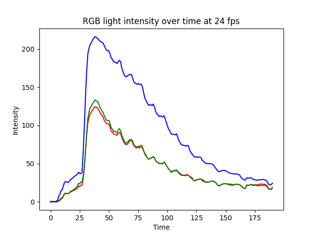

# Light intensity graph tool

<!-- show image in the static folder -->



## Description
This tool is used to generate a graph of light intensity over time. 

The different axes of the graph are: Intensity and Time. Where the intensity is measured with an average of the RGB values of the image and the time is frame number.

## Usage
To use this tool, you need to have a video file with the light source you want to measure. If you have python installed, you can run the following command to install the required libraries:
```bash
pip install -r requirements.txt
```

Then you can run the following command to generate the graph:
```bash
python app.py -i <input_video> -o <output_directory>
```

## Example
```bash
python app.py -i video.mp4 -o output
```

## Building
To build the python app to an executable, you can run the following command:
```bash
sh exe.sh
```
The executable will be in the dist folder. In this location, you can run the following command to execute the app(like the python command above, but without python installed):
```
./dist/app/app
```
